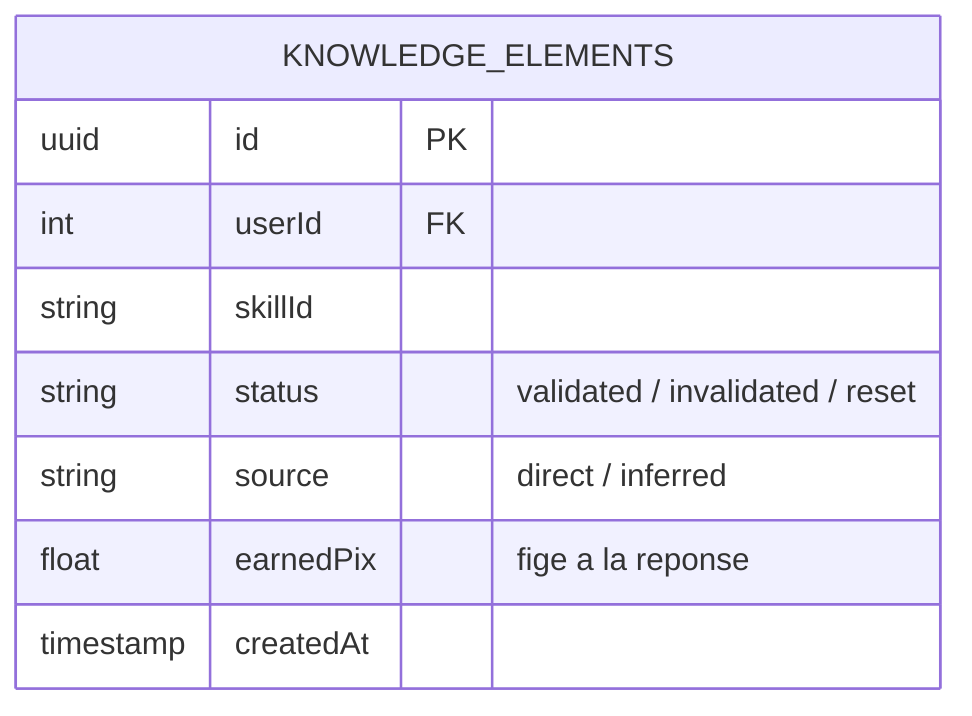
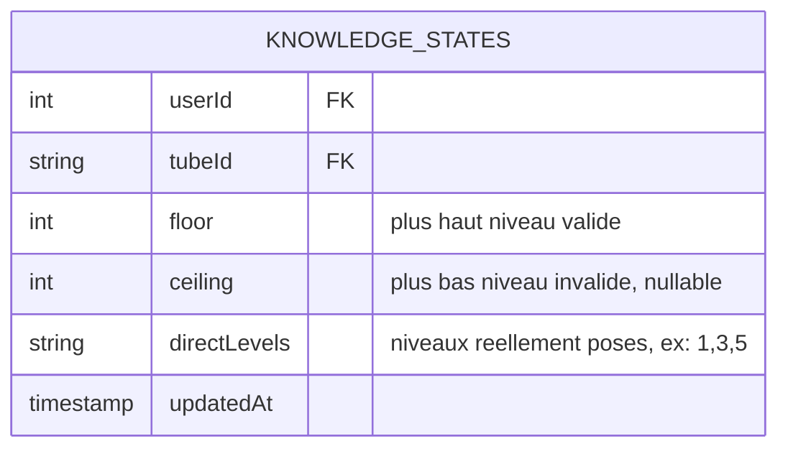

# 2. Structure de données — avant / après

### Avant

```mermaid
erDiagram
    KNOWLEDGE_ELEMENTS {
        uuid id PK
        int userId FK
        string skillId
        string status "validated / invalidated / reset"
        string source "direct / inferred"
        float earnedPix "fige a la reponse"
        timestamp createdAt
    }
```

### Après

```mermaid
erDiagram
    KNOWLEDGE_STATES {
        int userId FK
        string tubeId FK
        int floor "plus haut niveau valide"
        int ceiling "plus bas niveau invalide, nullable"
        string directLevels "niveaux reellement poses, ex: 1,3,5"
        timestamp updatedAt
    }
```
