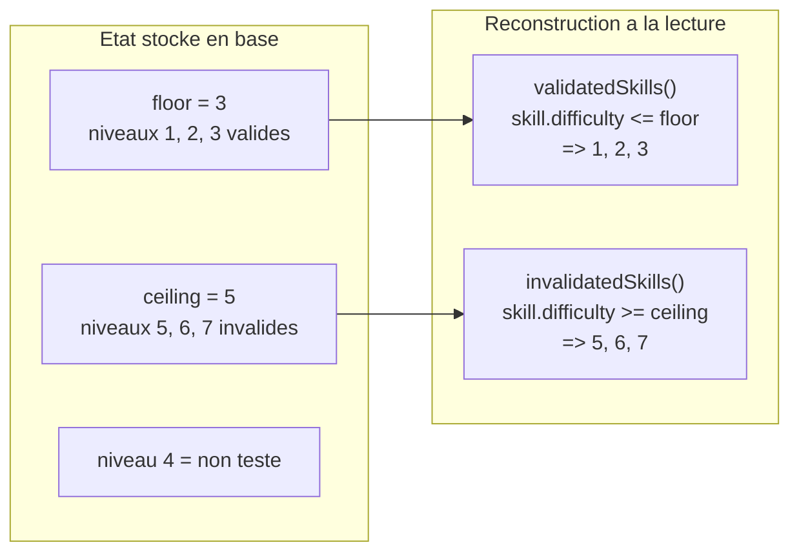

# 3. Mécanique des bornes floor / ceiling

```
Tube : [1]──[2]──[3]──[4]──[5]──[6]──[7]
                  ^              ^
               floor=3        ceiling=5
         OK OK OK     ?     KO KO KO
```


