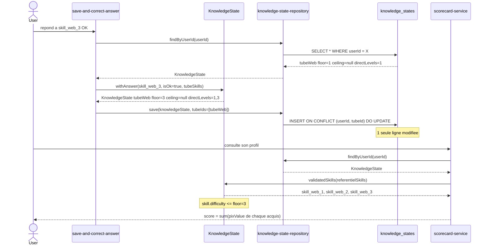

# 4. Cycle de vie complet — de la réponse au score

```mermaid
sequenceDiagram
    actor User
    participant UC as save-and-correct-answer
    participant Domain as KnowledgeState
    participant Repo as knowledge-state-repository
    participant DB as knowledge_states
    participant Score as scorecard-service

    User->>UC: repond a skill_web_3 OK
    UC->>Repo: findByUserId(userId)
    Repo->>DB: SELECT * WHERE userId = X
    DB-->>Repo: tubeWeb floor=1 ceiling=null directLevels=1
    Repo-->>UC: KnowledgeState

    UC->>Domain: withAnswer(skill_web_3, isOk=true, tubeSkills)
    Domain-->>UC: KnowledgeState tubeWeb floor=3 ceiling=null directLevels=1,3

    UC->>Repo: save(knowledgeState, tubeIds=[tubeWeb])
    Repo->>DB: INSERT ON CONFLICT (userId, tubeId) DO UPDATE
    Note over DB: 1 seule ligne modifiee

    User->>Score: consulte son profil
    Score->>Repo: findByUserId(userId)
    Repo-->>Score: KnowledgeState
    Score->>Domain: validatedSkills(referentielSkills)
    Domain-->>Score: skill_web_1, skill_web_2, skill_web_3
    Note over Domain: skill.difficulty <= floor=3
    Score-->>User: score = sum(pixValue de chaque acquis)
```
