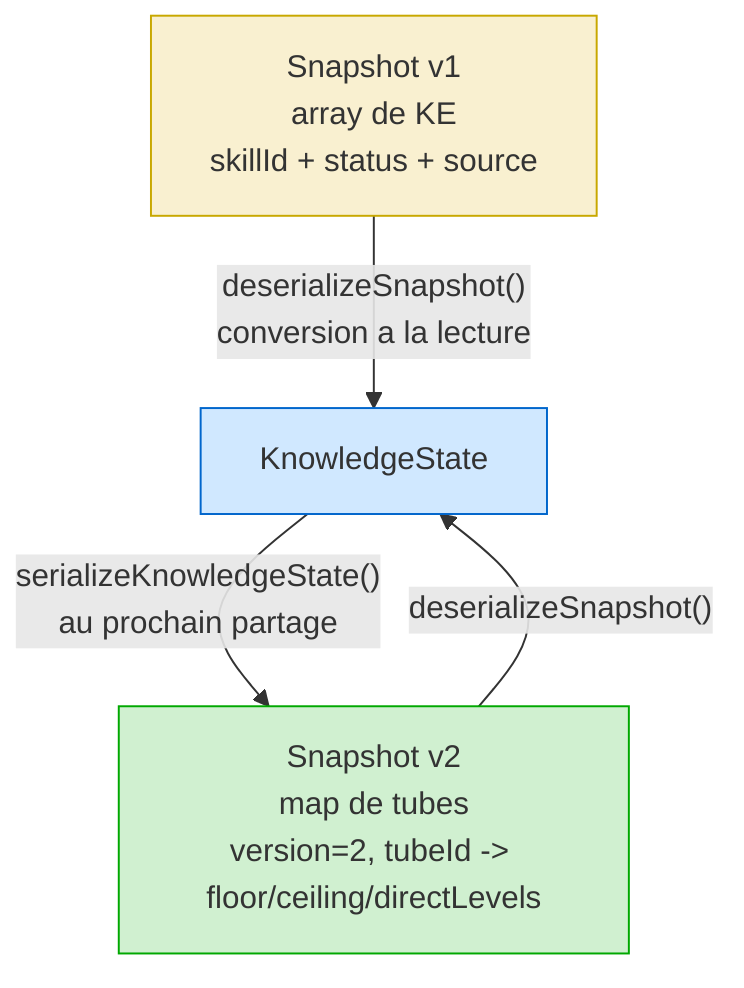

# 5. Rétrocompatibilité des snapshots de campagne

```mermaid
flowchart TD
    S1["Snapshot v1\narray de KE\nskillId + status + source"]
    S2["Snapshot v2\nmap de tubes\nversion=2, tubeId -> floor/ceiling/directLevels"]

    S1 -->|"deserializeSnapshot()\nconversion a la lecture"| STATE["KnowledgeState"]
    S2 -->|"deserializeSnapshot()"| STATE

    STATE -->|"serializeKnowledgeState()\nau prochain partage"| S2

    style S1 fill:#f9f0d0,stroke:#c8a800
    style S2 fill:#d0f0d0,stroke:#00a800
    style STATE fill:#d0e8ff,stroke:#0066cc
```
