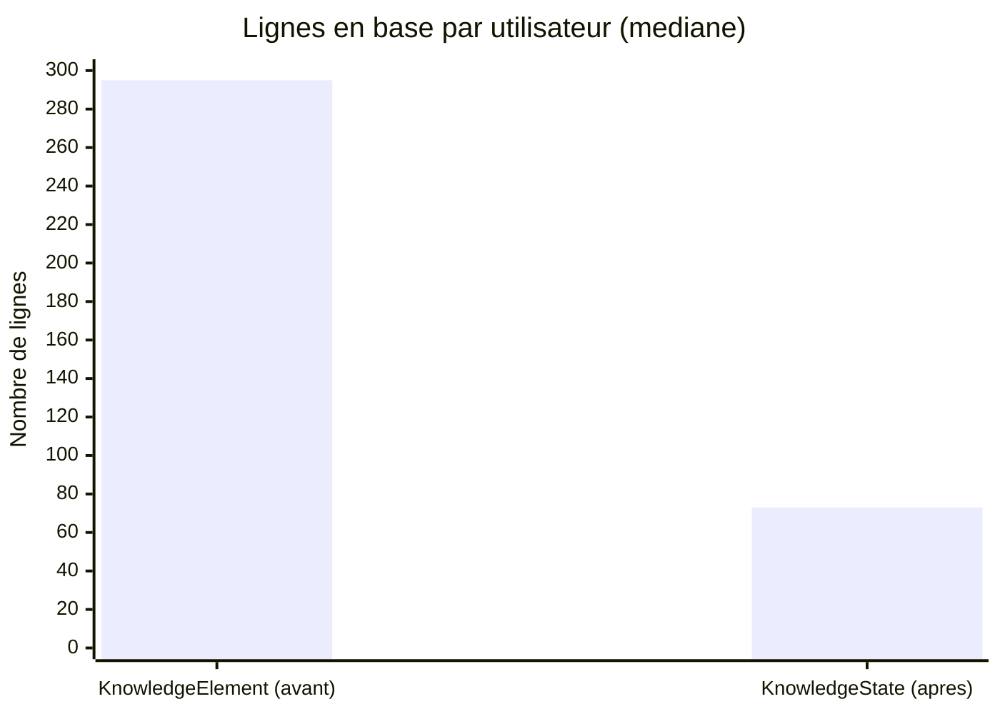

# 6. Compression volumétrique

| Métrique | Résultat |
|---|---|
| Facteur de compression (lignes DB) | **4,13x** |
| Facteur de compression (snapshots) | **3,22x** |
| Écarts de score expliqués | 649 / 649 (100 %) |
| Impact certifiabilité | 0 gain / 0 perte |
