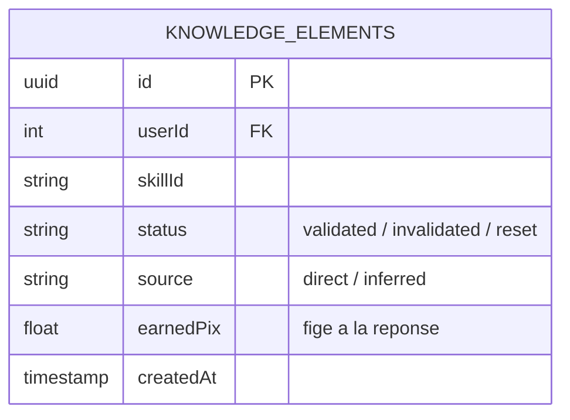
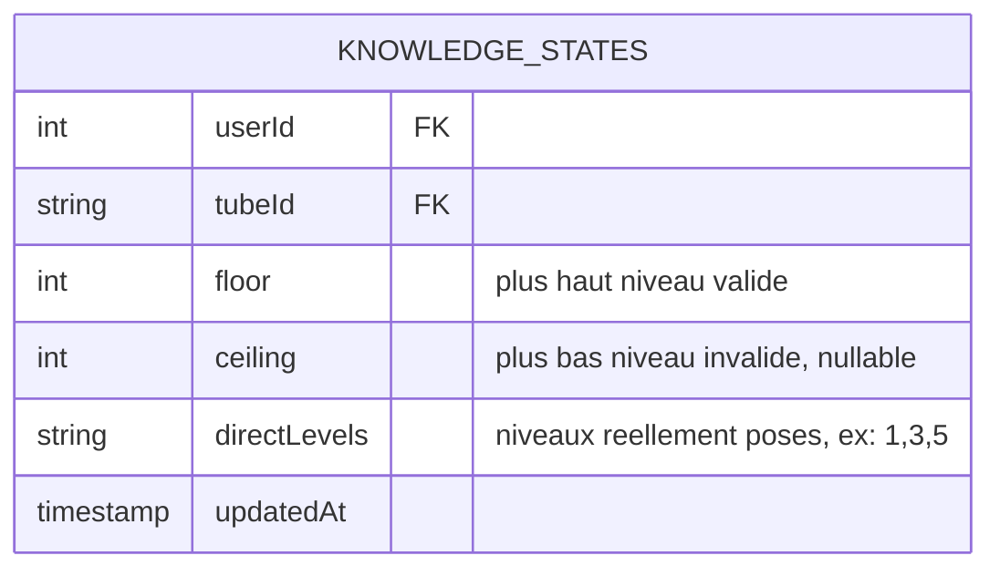
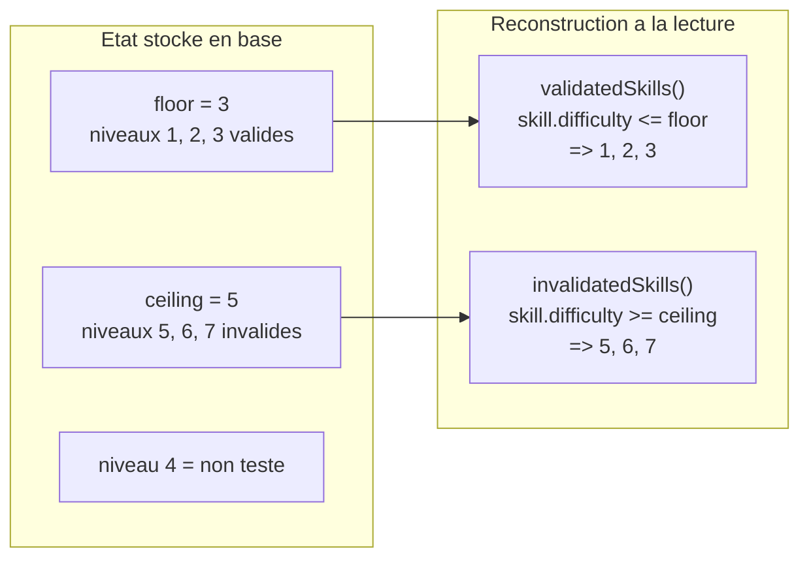
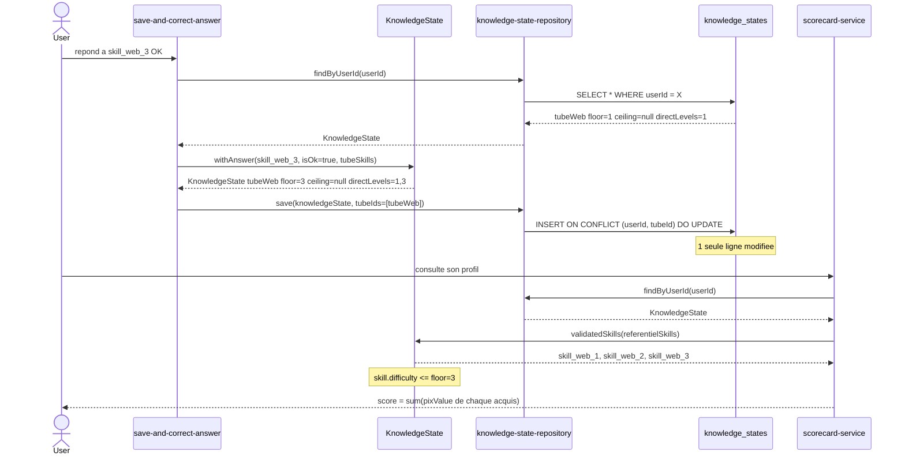
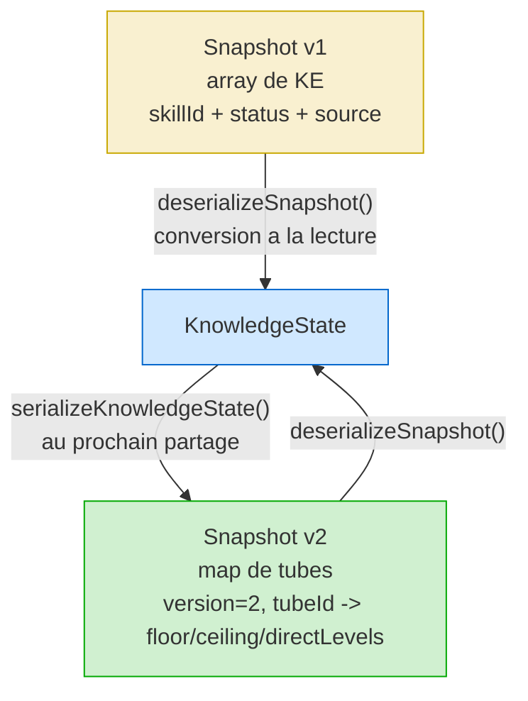
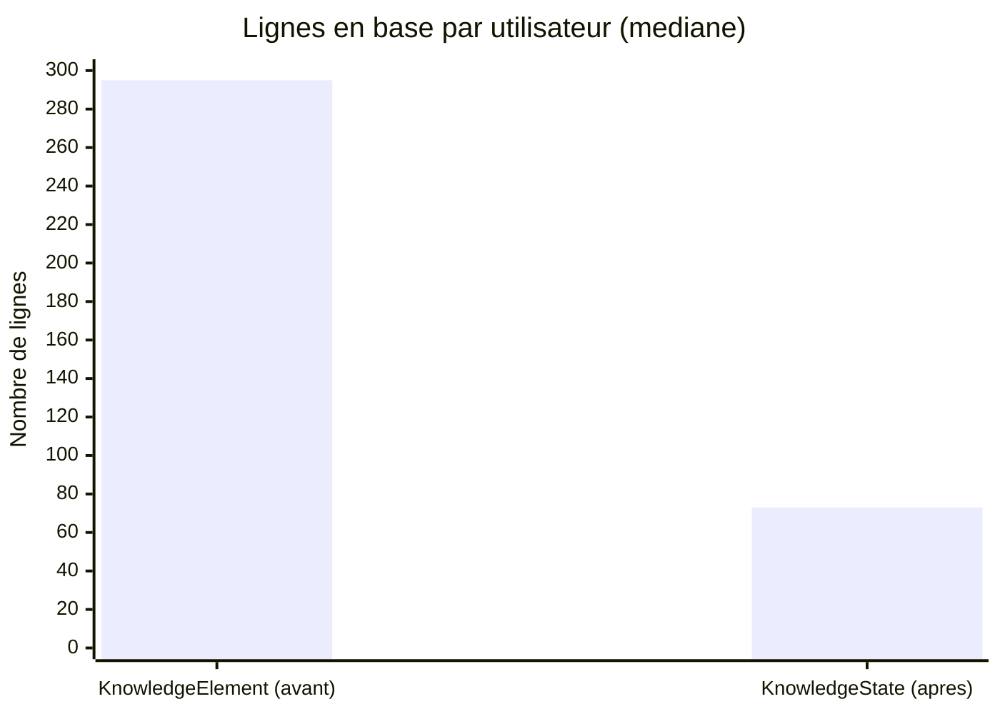

# KnowledgeState — Mécanisme et diagrammes

## 1. Flux de traitement d'une réponse

```mermaid
flowchart TD
    subgraph AVANT["Ancien modele - KnowledgeElement"]
        A1[Utilisateur repond a l acquis niveau 3] --> B1[Creer KE direct : skill_3 = validated]
        B1 --> C1[Inferer : skill_1 = inferred-validated]
        C1 --> D1[Inferer : skill_2 = inferred-validated]
        D1 --> E1[(Ecriture 3 lignes en DB - knowledge_elements)]
        E1 --> F1[Lecture : deduplication + tri par date + filtrage status != reset]
    end

    subgraph APRES["Nouveau modele - KnowledgeState"]
        A2[Utilisateur repond a l acquis niveau 3] --> B2[Charger etat du tube]
        B2 --> C2{Reussite ?}
        C2 -->|Oui| D2["floor = max(floor, 3)"]
        C2 -->|Non| E2["ceiling = min(ceiling, 3)"]
        D2 --> F2["directLevels = directLevels + 3"]
        E2 --> F2
        F2 --> G2[(UPSERT 1 ligne - knowledge_states)]
        G2 --> H2["Lecture : skill.difficulty <= floor -> valide"]
    end
```



---

## 2. Structure de données — avant / après

### Avant



### Après



---

## 3. Mécanique des bornes floor / ceiling

```
Tube : [1]──[2]──[3]──[4]──[5]──[6]──[7]
                  ^              ^
               floor=3        ceiling=5
         OK OK OK     ?     KO KO KO
```



---

## 4. Cycle de vie complet — de la réponse au score



---

## 5. Rétrocompatibilité des snapshots de campagne



---

## 6. Compression volumétrique



| Métrique | Résultat |
|---|---|
| Facteur de compression (lignes DB) | **4,13x** |
| Facteur de compression (snapshots) | **3,22x** |
| Écarts de score expliqués | 649 / 649 (100 %) |
| Impact certifiabilité | 0 gain / 0 perte |
