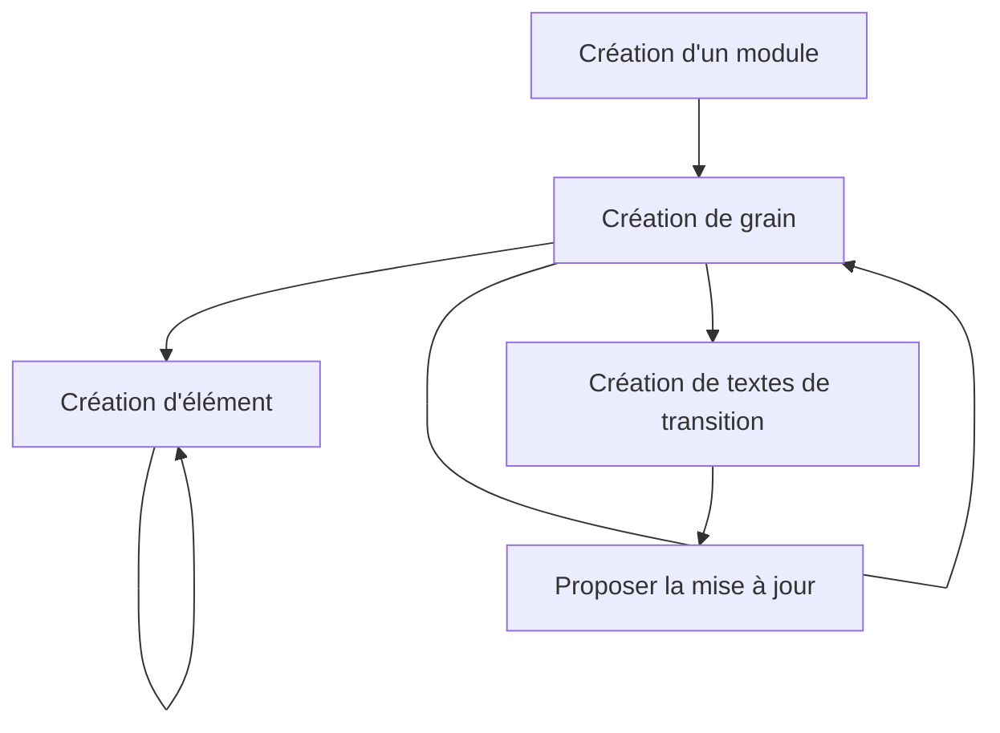

# Contenus des Modules de formation Pix (bêta)

Pix expérimente la mise à disposition de modules de formation autour des sujets numériques. Ils sont pour le moment conçus en interne, et utilisables via la plateforme Pix. Le répertoire `modules` sert de stockage technique des contenus des différents modules accessibles.

> [!IMPORTANT]
> Dans le cadre de l'expérimentation, nous n'accepterons pas de contributions externes.
> Si l'expérimentation vous intéresse, vous pouvez contacter l'équipe projet à l'adresse email `equipe-modulix@pix.fr`.

Ce fichier sert de documentation interne pour guider les équipes dans leurs contributions.

## Contribution aux contenus

### Mise en place de son environnement local

Il est fortement recommandé de suivre [le guide d'installation](/INSTALLATION.md) pour prévisualiser les contenus sur la plateforme Pix directement sur son poste.

Pour accéder à la plateforme, il est nécessaire de démarrer le projet `mon-pix` et `api`. Pour itérer de manière optimale, on recommande de lancer le serveur avec redémarrage automatique via la commande `npm run start:watch`.

Les modules sont accessibles via l'URL : `http://localhost:4200/modules/<slug-du-module>`.

### Mise à jour des contenus

Les contenus sont placés dans des fichiers [au format `.json`](http://www.json.org/json-fr.html). Chaque fichier `.json` correspond à un module de formation. Ces fichiers respectent une structure commune. Le [didacticiel](./modules/didacticiel-modulix.json) sert de démo technique et utilise donc toutes les fonctionnalités existantes.

> [!IMPORTANT]
> Le format et la structure des fichiers n'est pas finalisé. Il est tout à fait possible qu'un autre format soit utilisé après l'expérimentation.

#### Procédure de contribution au contenu



#### Création d'un nouveau module

Il faut créer un nouveau fichier `.json` dans le dossier `modules`. Le nom du fichier doit être unique. Il doit respecter un format alphanumérique, en minuscule et avec des tirets entre les mots. TODO : définir règles contenu et bonnes pratiques.

Un module est composé de plusieurs méta-données :
- Un `slug` : l'identifiant unique du module. Sert à construire l'URL d'accès du module. Doit correspondre au nom du fichier,
- Un `title` : le titre du module affiché à l'utilisateur,
- Des `details` :
  * Une `image` affichée en haut de la page de détails du module. Format `.svg`,
  * Une `description` affichée sur la page de détails du module,
  * Une durée `duration` en minutes,
  * Un niveau `level` : `Débutant`/`Intermédiaire`/`Avancé`/`Expert`,
  * Une liste d'objectifs `objectives` affichés sur la page de détails du module.

#### Évolutions du contenu d'un module

Dans chaque module, la clé `grains` contient tous les grains pédagogiques d'un module.

Chaque grain possède :
- Un identifiant technique `id` au format [UUID v4](https://www.uuidgenerator.net/version4),
- Un type `lesson` ou `activity`,
- Un titre `title` utilisé pour structurer la page pour les lecteurs d'écran,
- Une liste d'éléments

##### Créer et modifier des élements

En se plaçant dans un terminal sur le dossier `api`, il est possible de générer un example d'élément via ligne de commande.

Par exemple, pour générer un élément textuel :
```shell
node ./scripts/modulix/get-sample-text-element.js
```

Les types d'éléments disponibles pour le moment sont :  `image`, `qcm`, `qcu`, `qrocm`, `text`, `video`.

#### Valider les règles techniques du contenu d'un module

En se plaçant dans un terminal sur le dossier `api`, on peut valider la syntaxe des fichier `.json` et leur respect des règles.

```shell
npm run modulix:test
```

### Proposer une mise à jour

On recommande de suivre [les règles de contribution partagées](/CONTRIBUTING.md).

L'idée est de créer une Pull Request (PR) sur ce projet.

Pour éviter les erreurs au maximum, la procédure de validation technique présentée ci-dessus est exécutée en ligne. Si une erreur est détectée la proposition ne pourra pas être mise en ligne. Cette procédure est réexecutée à chaque remise à jour de la PR.

Un environnement temporaire est également créé pour chaque PR pour permettre de visualiser les évolutions proposées.

Les équipes en charge des contenus peuvent faire leurs retours directement dans la PR afin d'itérer rapidement.

Une fois validée, les modifications suivent le processus de mise en production.
