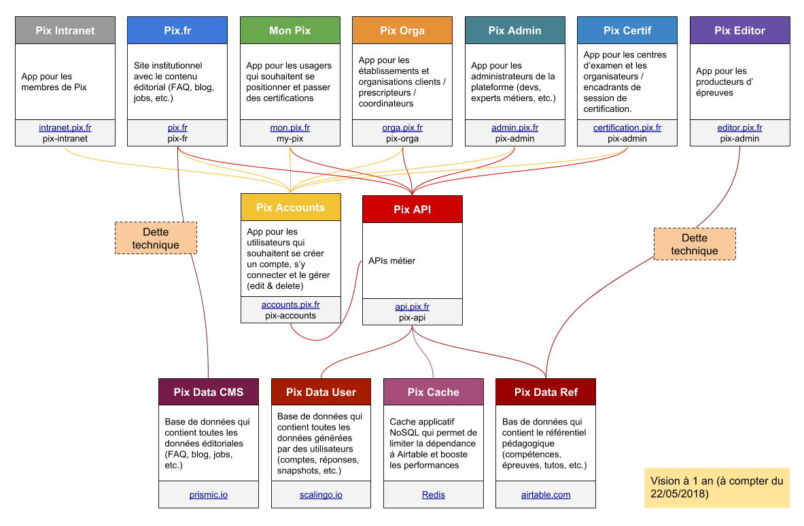

# 2. Style d'architecture

Date : 2019-08-22

## État

Accepté

## Contexte

La mission de Pix est d'accompagner la société et les citoyens à prendre le train du numérique dans les meilleures conditions et délais.

Pour accomplir cet objectif ambitieux, Pix table sur une stratégie à 3 dimensions :
- fournir un (bouquet de) service(s) de qualité accessible au plus grand nombre
- co-construire un standard reconnu et validé par tous (établissements et structures scolaires ou d'enseignement supérieur, organisations profesionnelles / publiques / privées, administrations, associations, etc.)
- développer une communauté et une culture Pix

Une partie du premier axe d'action est adressée à travers le développement d'une "plateforme numérique en ligne".

Étant donné l'aspect très grand public du projet, la plateforme doit répondre aux exigences de qualité suivantes :
- innovante,
- moderne,
- fiable,
- accessible, 
- sécurisée,
- performante 

Par ailleurs, la plateforme doit respecter les caractéristiques suivantes :
- réactive par rapport au marché de l'évaluation et de la certification des compétences numériques en ligne, et à une approche "Lean Product Management"  
- évolutive selon la couverture de marché et la complexité grandissante du métier
- ouverte (i.e. interopérable) des SI tiers ou externes, en lecture/écriture, avec des flux entrant/sortant

Enfin, la plateforme doit permettre simplement, rapidement et à moindre coût l'émergence, l'ajout, la suppression, la mise à jour et la maintenance de services SI de différente sorte, en fonction des besoins métier ou technique.

## Décision

L'un des éléments essentiels dans la mise en place d'une plateforme, est le développement possible et effectif d'un "écosystème". 

Dans ce contexte, on appelle écosystème l'ensemble formé entre des composants SI, leurs interactions les uns avec les autres et l'environnement dans lequel ils sont exécutés. Exemples de composants : une webapp Ember, une webapp Rails, une API, une base de données, un server SMTP, un service SaaS, etc.

Le style d'architecture retenue pour la mise en œuvre de la plateforme Pix et de son écosystème est le suivant :

- 1 API métier (back) sécurisée, fiable et performante
- gérant l'accès et la manipulation de différents référentiels de données 
- afin d'alimenter plusieurs applications clients (front) dédiées et optimisées pour un usage et une audience particuliers 

Tout accès ou manipulation d'un référentiel de données (base de données, service en ligne, cache applicatif, etc.) DOIT être effectué et restreint à l'API. 

Une application front NE DOIT PAS accéder directement un référentiel de données, afin de diminuer le risque lié à la sécurisation des données personnelles ou business.

Une application front DOIT couvrir un seul périmètre métier, afin d'offrir aux utilisateurs du service concerné une expérience optimale, limiter la complexité lors des développements et favoriser des mises à disposition du public / marché fréquentes et rapides. 

L'intelligence métier DOIT être codée ou située dans l'API. Elle NE DOIT PAS être dans les applications front.

Toute application front DOIT permettre aux utilisateurs un usage confortable et adapté à leurs besoins. Pour ce faire, une application front PEUT proposer des contrôles de surface et autres interactions mouf-mouf. Une application front PEUT "imiter" afin de les prévenir certains contrôles métier, qui DOIVENT néanmoins être présents côté back.

## Conséquences

Ce style d'architecture nécessite de gérer plusieurs projets / applications.

Par ailleurs, afin de proposer une expérience utilisateur optimale, certaines règles métier peuvent être codées plusieurs fois (dans l'API et dans le·s front·s correspondant·s).

Enfin, certaines fonctionnalités techniques basiques peuvent être dupliquées entre plusieurs applications front.
