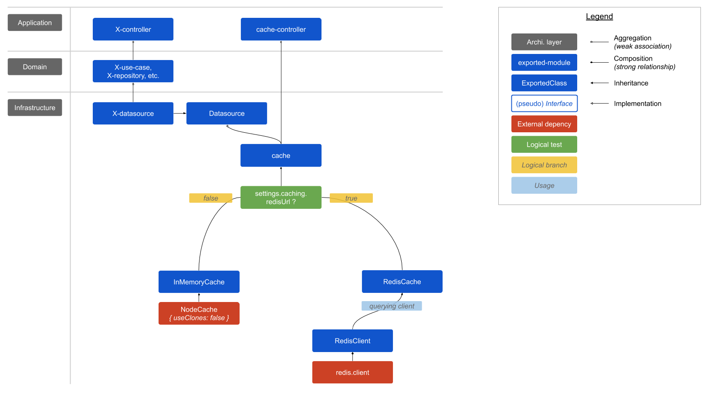
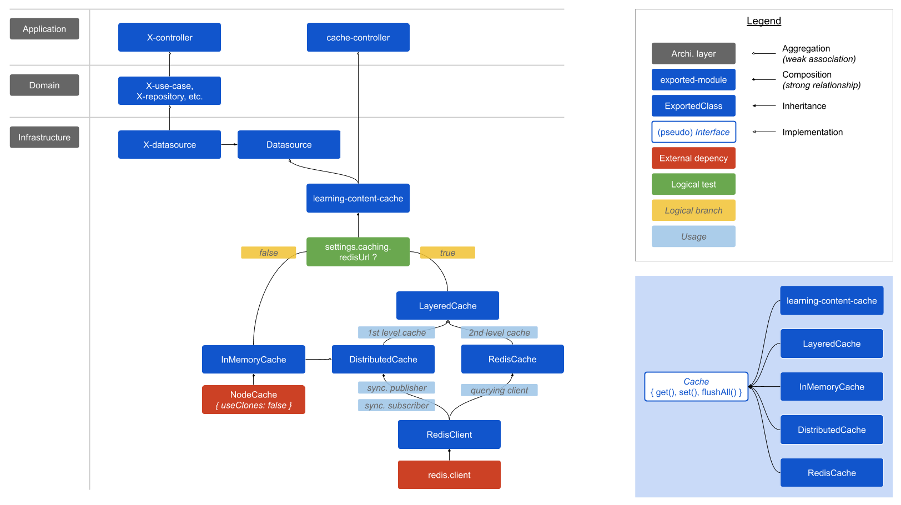

# 4. Traitement du type date sans horaire dans Pix

Date : 2020-01-08

## État

Draft

## Contexte

Le contenu pédagogique désigne l'ensemble des informations permettant d'évaluer les compétences numériques des utilisateurs : Domaines, Compétences, Tests, Épreuves, Sujets (Tubes), Acquis, Tutoriaux.

Ces informations sont définies et contenues dans un référentiel de données de type SaaS, Airtable. Cette solution impose une limite d'appel de 5 req/s. Au-delà de cette limite, toutes les requêtes à l'API d'Airtable sont bloquées pendant 30s.

Afin de pallier à cette limite, un système de cache système a été mis en place, basé sur Redis. Le référentiel de données pédagogiques est rechargé quotidiennement, en récupérant toutes les données d'Airtables et en les stockant dans Redis. Ainsi, en utilisation normale, le système ne sollicite quasiment jamais Airtable.

À date, le système de cache utilisé sur Pix n'est utilisé que pour le contenu pédagogique.  

Un cache basé sur Redis présente tout de même des défauts et limites :
- nombre de requêtes réseau nécessaires, notamment pour un appel de type `GetNextChallenge`
- nombre et durée de vie des connexions Redis (cf. [issue Sentry](https://sentry.io/organizations/pix/issues/1355712536/?project=1398749))
- obligation de sérialization/désérialization des informations sous forme de String
 
Par ailleurs, les données du référentiel sont stockées en double dans Redis : 
 - sous forme d'enregistrement individuel, ex : "Challenge_recAbcd", "Challenge_recEfgh"
 - sous forme de liste agrégée, ex : "Challenges"
 
Le problème d'une telle gestion des données est qu'elle donne lieu à plusieurs scénarios permettant une désynchronisation des données agrégées ou individuelles.
 
Le système actuel présente donc des limites blocantes aussi bien techniques (perfs, charges) que fonctionnelles (qualité des données).

 
## Décision

Afin d'améliorer les performances, tout en optimisant notre consommation de ressources, nous décidons de **mettre en œuvre un cache applicatif mémoire distribué**.

Par ailleurs, nous décidons de ne conserver que la forme agrégées des données stockées dans Redis, afin de consolider notre gestion des données référentielles.

La synchronisation des caches mémoires des différentes instances d'API se fait via le mécanisme de notification (pub/sub) de Redis. 

## Conséquences

### Architecture

D'un point de vue architecture logicielle, elle évolue comme tel :

Avant : 

Après : 

### Optimisation des ressources & performances

Les performances de l'API sont largement améliorées : 
- diminution des requêtes réseau, car (quasiment) plus besoin d'accéder à Redis
- diminution, de fait, du risque d'avoir des problèmes de connexion Redis
- diminution du nombre de traitements (serialization/deserialization JS/string) lors des appels Redis
- diminution très importante, des temps de réponse moyenne
- augmentation proportionnelle, de la capacité à encaisser de la charge
- amélioration de la consistence + cohérence + fraîcheur des données pédagogiques

TODO : mettre les résultats des tests de charge

### Enrichissement de l'outillage de caching

Plusieurs classes et type de cache (en mémoire, distribué, Redis) sont disponibles pour implémenter des caches avec des stratégies et dans des conditions spécifiques :
- cache mémoire
- cache distribué (basé sur Redis Pub/sub)
- cache multi-niveau
- cache Redis

Chaque brique de cache est conçue pour être générique et composable l'une avec/pour l'autre.

