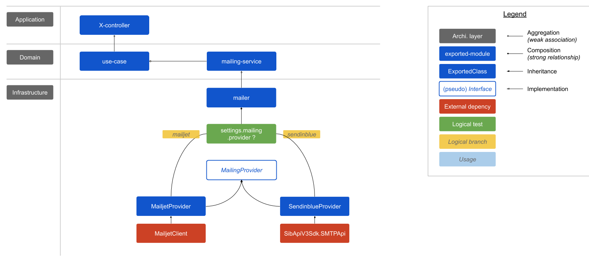

# 6. Ajout du support de SenInBlue pour l'e-mailing

Date : 2020-01-28

## État

Accepted

## Contexte

Les DANE et académies ont tendance à bloquer les providers commerciaux et filtrent les messages avec un mécanisme de whitelisting d'IP.

Par ailleurs, nous avons été plusieurs fois rencontrés des difficultés avec MailJet (API limit, communication, support), en particulier lors de moments ou phases critiques.

Sans compter que MailJet a été racheté par MailGun, entreprise américaine. **MailJet est donc désormais soumis au CLOUD Act.**

## Décisions

Pour passer le filtrage des académies, nous décidons de nous munir d'une IP fixe, que nous communiquons à nos partenaires.

Nous décidons de louer cette adresse IP chez un nouvel hébergeur, Sendinblue, éditeur français dont les données sont hébergées en France, et qui n'est pas a priori soumis au CLOUD Act.

Nous décidons d'implémenter un connecteur SendInBlue, sur le même modèle que le connecteur Mailjet : les infos du message dans le code, le template sur le site du provider.

Nous décidons de conserver le connecteur MailJet, au cas où nous serions déçu de SendInBlue, ou dans l'optique un jour d'implémenter un mécanisme de fallback.

## Conséquences

Ajout et modification des variables d'environnement suivantes :
- `MAILING_PROVIDER` : _string_ ["mailjet" | "sendinblue"]
- `MAILJET_API_KEY` : _string_
- `MAILJET_API_SECRET` : _string_
- `SENDINBLUE_API_KEY` : _string_ 
- `SENDINBLUE_ACCOUNT_CREATION_TEMPLATE_ID` : _string_
- `SENDINBLUE_ORGANIZATION_INVITATION_TEMPLATE_ID` : _string_
- `SENDINBLUE_PASSWORD_RESET_TEMPLATE_ID` : _string_

## Liens

- [Lien vers le schéma](https://docs.google.com/drawings/d/1JAsGp_B2lmQYJij8Iz7WvcIygalCgaGgRfjzREHGK8M/edit?usp=sharing)
- [MailJet est soumis au CLOUD Act](https://www.mailjet.com/blog/news/security-privacy-email/#cloud)
