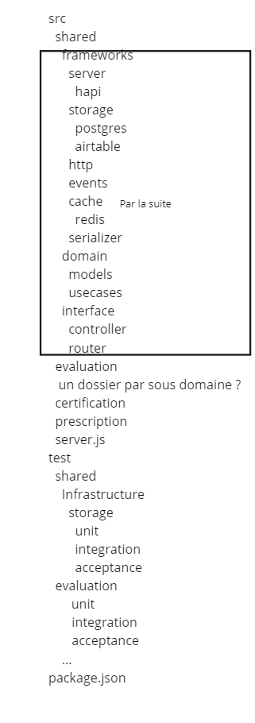
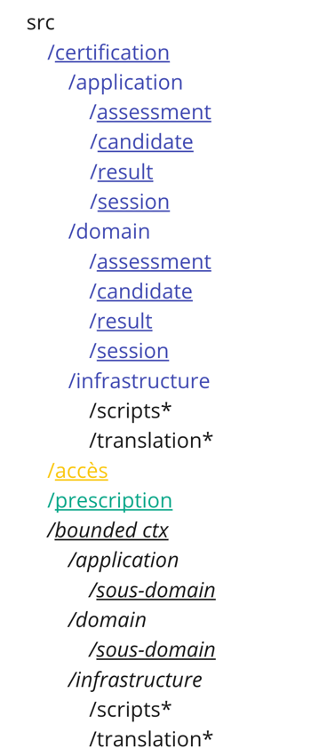
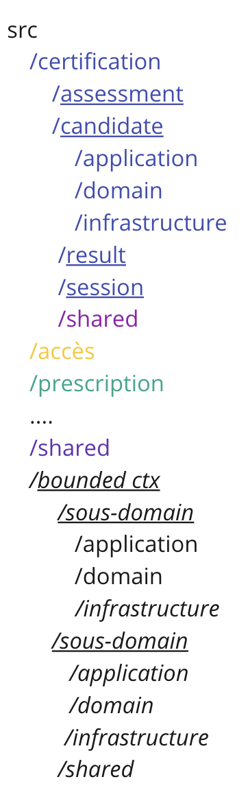

# 49. Arborescence API

Date : 2023-07-20

## État

Accepté

## Contexte

### Constat

- Les répertoires contiennent beaucoup de fichiers (ex : 306 fichiers dans le dossier usecases), ce qui oblige le développeur à chercher.
- Les répertoires sont parfois nommés d'après le domaine fonctionnel (ex : `certification`) et parfois d'après le domaine technique (ex: `serializers`).
- Le domaine fonctionnel n'est porté que par le nom des fichiers (ex : certification).
- Les noms de fichiers sont trop longs et pas significatifs (ex : `create-user-and-reconcile-to-organization-learner-from-external-user`).
- Certains dossiers contiennent des éléments disparates (ex : `utils` ou `helpers`).

À cause de cela, il est difficile de naviguer dans l’arborescence, aussi bien pour les nouveaux que pour les anciens.

### En chiffres

- 157 fichiers à plat dans le répertoire /api/lib/domain/models
- 280 fichiers à plat dans le répertoire /api/lib/domain/usecases
- 56 fichiers à plat dans le répertoire /api/lib/domain/read-models
- 133 fichiers à plat dans le répertoire /api/lib/infrastructure/repositories

### Problématique

- Repenser l’arborescence de Pix-API afin de faciliter le travail des équipes selon les contextes métier
- Éclaircir et documenter l’arborescence de l’API

### Objectifs

- Matérialiser les contextes métier dans l’arborescence
- Mise en avant d’une sémantique fonctionnelle
- Structure claire et lisible pour les équipes
- Clarifier les intentions dès les premiers répertoires (et pouvoir approfondir pour détailler par couche)
- Limiter le nombre de fichiers par répertoire

### Contraintes

- Respecter la Clean Architecture Pix
- Utiliser la définition commune des contextes issue des events storming comme point de départ (tout Pix/Engineering) (https://miro.com/app/board/uXjVPomHtls=/?moveToWidget=3458764562181529349&cot=14)
- Refactorings uniquement structurels
- Changements iso-fonctionnels
- Pas de régression (CI passe, tests passent, iso-perfs, pas de bug)
- Ne pas dégrader l’expérience de développement sur l’API
- Se limiter à l’API de Pix

### Solution 1 : Structure par contexte fonctionnel + modification structure clean archi

Avantages :

- Séparation par contexte fonctionnel
- Possibilité de lancer les tests par contexte fonctionnel
- Miroir avec type de test en sous répertoire
- Permet de réduire le nombre des fichiers à plat dans les répertoires

Inconvénients :

- Verbeux
- Impact sur la clean archi actuelle => ne respecte pas les contraintes

### Solution 2 : Contexte fonctionnel en répertoire visible en premier + sous domaine en sous répertoire du domaine et d'application

Avantages :

- Séparation par contexte fonctionnel
- Miroir avec type de test en sous répertoire
- Permet de réduire le nombre des fichiers à plat dans les répertoires

Inconvénients :

- Mélange de termes techniques et fonctionnels dans l'arborescence
- Verbeux (duplication de sous domaine)

### Solution 3 : Contexte fonctionnel en répertoire visible en premier + sous domaine en sous répertoire du contexte fonctionnel

Avantages :

- Séparation fonctionnelle par contexte fonctionnel
- Miroir avec type de test en sous répertoire
- Transition des termes métiers vers des termes techniques
- Permet de réduire le nombre des fichiers à plat dans les répertoires

Inconvénients :

- Verbeux (duplication des dossiers application/domain/infrastructure dans les sous domaines)

## Décision

La solution 3 sera mise en place, car elle est proche de l'existante tout en mettant en place la distinction par contexte fonctionnel.

## Remarque

L'arborescence ne doit pas correspondre à un découpage par équipe, mais doit refléter les différents contextes métiers.
Du fait du découpage historique des équipes sur la base de critères métiers, on retrouve des contextes fonctionnels avec le nom "très proche" de celui des équipes (ex: certification, prescription, evaluation, access).
Les bounded contexts de l' "Event storming", indiqué dans les contraintes, nous servent de base pour le premier refactoring mais il ne s'agit pas d'une "spécification".
Ils pourront/devront être revus au cours du temps par les équipes pour s'adapter au métier.

## Conséquences

- Création d'un dossier src au même niveau que lib avec la nouvelle arborescence. La PR avec cette structure se trouve [ici](https://github.com/1024pix/pix/pull/6658).
- Les différentes équipes devront migrer pas à pas les fichiers de lib vers la nouvelle arborescence.
