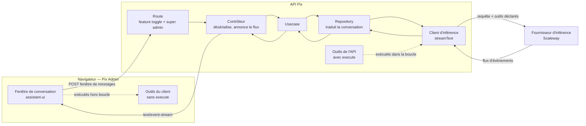
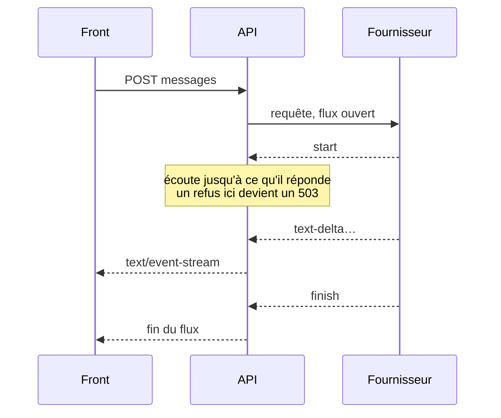
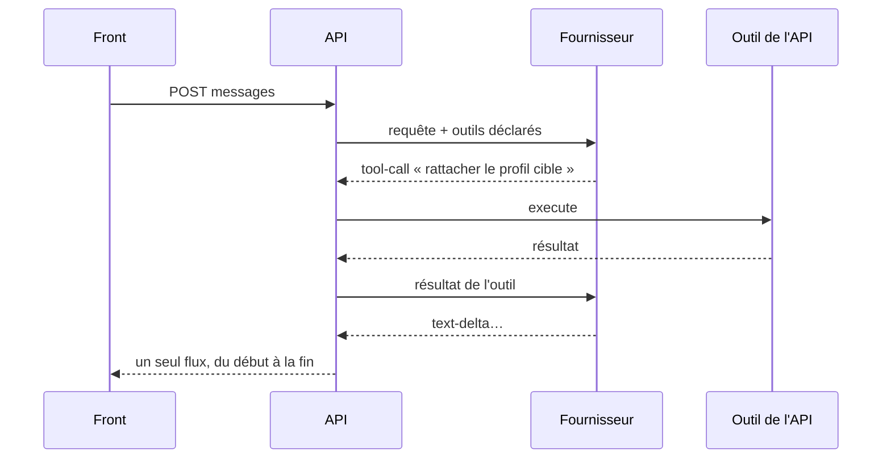
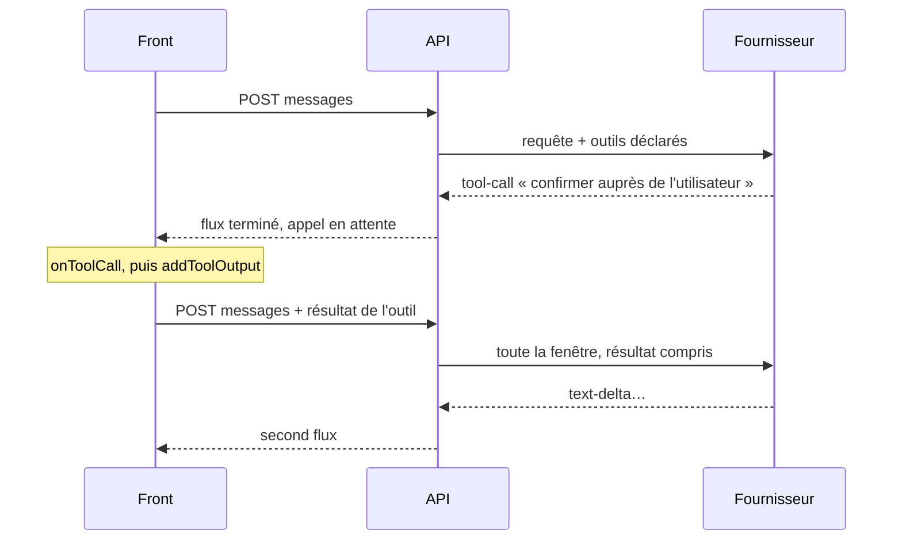

# Les appels d'outils, et ce qu'ils changent

Ce document explique comment les appels d'outils circulent entre le front de Pix Admin, l'API et le
fournisseur d'inférence, et pourquoi deux familles d'outils imposent deux flux différents.

Il ne couvre pas le choix des outils à offrir, ni leur autorisation, ni le MCP. Pour ce qui est
aujourd'hui en place, voir [spec.md](spec.md).

## Les briques

Le point à retenir : **les deux familles d'outils sont déclarées au même modèle, mais ne s'exécutent
pas au même endroit, ni au même moment.**

## Aujourd'hui — du texte, un aller-retour

Une requête, une réponse. C'est ce qui tourne.

## Outil exécuté dans l'API — toujours un aller-retour

Un outil déclaré avec sa fonction `execute` est exécuté par le SDK **à l'intérieur** du flux. Le
modèle demande, le SDK exécute, renvoie le résultat au modèle, et le modèle continue. Le navigateur
ne voit passer que des évènements.

Le nombre d'étapes se borne côté API, avec `stopWhen`. Sans borne, un modèle peut boucler.

## Outil exécuté dans le client — deux allers-retours

Un outil déclaré **sans** `execute` ne peut pas être exécuté par l'API. Le flux se termine sur un
appel d'outil en attente. Le navigateur l'exécute, puis **repost toute la fenêtre de conversation**,
résultat d'outil compris.

C'est ce second POST qui change tout pour nous.

## Ce que ça casse aujourd'hui

**La fenêtre de conversation ne sait pas transporter un appel d'outil.** `Message` porte un
identifiant, un rôle et un contenu textuel. Le désérialiseur ne garde que les parties de type
`text` et jette les autres.

Donc, au second POST, le résultat de l'outil serait **supprimé à la frontière**. Le modèle, ne le
voyant pas, redemanderait le même outil. La conversation tournerait en rond.

Trois conséquences, par ordre de profondeur :

**La règle de frontière.** `Conversation` exige aujourd'hui que la fenêtre se termine sur une
question, parce que c'est au dernier message que le modèle répond. Au second POST, la fenêtre se
termine sur un résultat d'outil. La règle devra donc devenir « se termine sur une question ou sur
un résultat d'outil », et c'est la racine d'agrégat qui la porte.

**Le modèle de domaine.** Un tour d'échange n'est plus seulement du texte. Il faut décider si
`Message` gagne des variantes, ou si une notion distincte apparaît à côté de lui. C'est la décision
structurante, et elle touche la racine d'agrégat.

**Le contrat d'entrée.** La route déclare déjà `parts` et `tools` sans les typer. Tant qu'un appel
d'outil n'a pas de forme arrêtée, cette déclaration ne vérifie rien.

**La frontière de confiance.** Un résultat d'outil arrivant du navigateur est une donnée fournie par
le client, pas un fait établi par l'API. Si un outil de l'API s'appuie dessus, la validation ne peut
pas se contenter de la forme.

## Questions ouvertes

Quels outils doivent vraiment s'exécuter dans le navigateur. La règle courante est : seulement ceux
qui ont besoin du contexte du navigateur, ou d'une confirmation de la personne. Tout ce qui touche
aux secrets, à la base ou à la latence reste côté API.

Où se branche le MCP. Un serveur MCP alimenterait les outils de l'API, donc la boucle sans
aller-retour. Reste à savoir s'il est appelé par le client d'inférence ou déclaré plus haut.

Comment un outil qui écrit est autorisé. Rattacher un profil cible n'est pas lire une fiche, et la
décision n'appartient pas au modèle.

## Sources

- [AI SDK UI : Chatbot Tool Usage](https://sdk.vercel.ai/docs/ai-sdk-ui/chatbot-with-tool-calling)
- [Appels d'outils parallèles côté client : résultat réputé manquant](https://github.com/vercel/ai/issues/11267)
