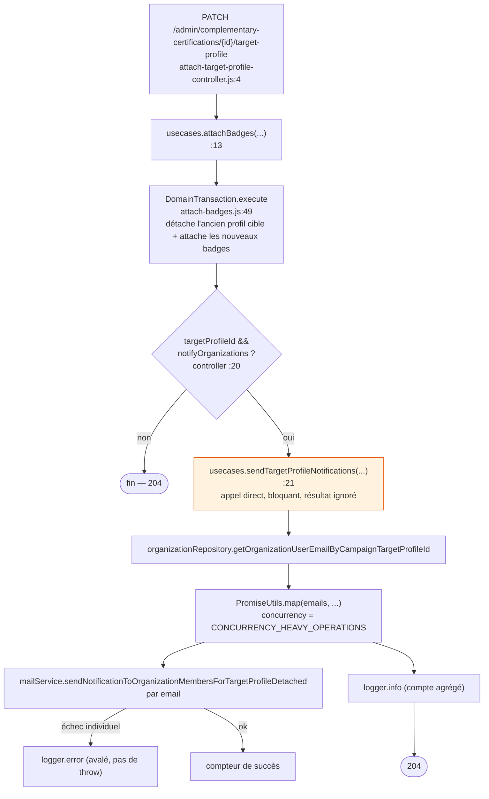
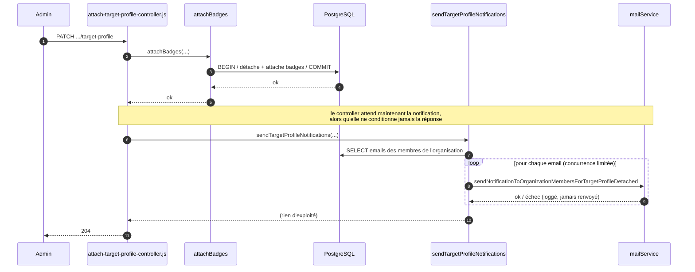
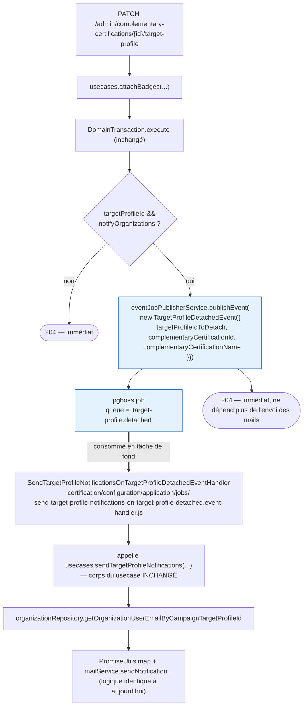
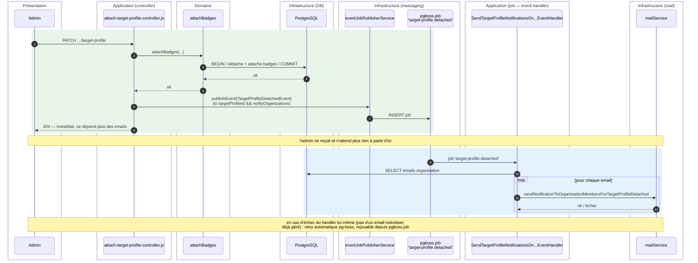

# Migration détaillée — notifications de détachement de profil cible → EDA

> Quatrième document du dossier `poc-eda`, dédié au candidat identifié comme **le plus simple à
> convertir** en event-driven (cf. échange précédent) : `sendTargetProfileNotifications`, dans le
> bounded context `certification/configuration`. Contrairement à `la_quete_de_claude*.md` (qui
> documentent la cascade `answer.saved`, plus large et pas encore codée), cette migration est
> volontairement petite, isolée à un seul bounded context, et sert de "premier pas" très faible
> risque pour valider le pattern EDA en conditions réelles avant de s'attaquer à la cascade des
> réponses.

## Pourquoi ce candidat est facile

- Le controller ne regarde jamais le résultat de l'appel (`204` sans corps).
- Le usecase avale déjà les échecs individuels d'envoi de mail (`logger.error` par email), donc il
  se comporte déjà comme un traitement "best effort" — l'event handler n'a rien de plus à gérer.
- Un seul bounded context est concerné (`certification/configuration`), aucune traversée de
  frontière comme dans l'anonymisation (4 bounded contexts) ou la cascade `answer.saved` prévue
  (`evaluation` → `quest` → `prescription`).
- Aucune transaction DB à repenser : `attachBadges` a déjà sa propre `DomainTransaction.execute` et
  commite avant même que `sendTargetProfileNotifications` soit appelé aujourd'hui — l'ordre "publier
  après un commit" est donc déjà respecté naturellement par le code existant.

---

## 1. État actuel

**Fichiers concernés**
- `api/src/certification/configuration/application/attach-target-profile-controller.js:13-25`
- `api/src/certification/configuration/domain/usecases/send-target-profile-notifications.js:8-45`



**Séquence temporelle**



**Problème** : si l'organisation a beaucoup de membres, ou si le service mail est lent, l'admin
attend inutilement — la réponse HTTP est bloquée par un traitement dont le résultat n'a aucune
incidence sur elle.

---

## 2. Conception cible

Un seul événement, un seul consommateur (pas de cascade multi-sauts ici, contrairement à
`answer.saved` — volontairement simple pour ce premier cas).



**Séquence temporelle**



---

## 3. Étapes de migration

### Étape 1 — Créer l'événement `TargetProfileDetachedEvent`

Fichier : `api/src/certification/configuration/domain/events/TargetProfileDetachedEvent.js`

- Constructeur : `{ targetProfileIdToDetach, complementaryCertificationId, complementaryCertificationName }`.
- `static get eventName()` + `get eventName()` → `'target-profile.detached'` (aligné sur le format
  `bounded-context-action.participe` déjà utilisé : `answer.saved`, `quest.obtained`,
  `anonymize-user.requested`).
- `get payload()` renvoie l'objet ci-dessus.
- `get options()` renvoie `{}` (aucune option pg-boss custom nécessaire, comme `AnonymizeUserEvent`).

**Pourquoi `complementaryCertificationName` dans le payload et pas l'objet `complementaryCertification`
complet** : un événement doit transporter des données sérialisables et stables, pas un objet
domaine complet (`ComplementaryCertification`) qui pourrait évoluer ou être coûteux à
resérialiser côté pg-boss. Le handler n'a besoin que du `label`.

**Vérification** : test unitaire simple vérifiant `eventName`/`payload`, sur le modèle de
`AnonymizeUserEvent` (`api/tests/unit/privacy/domain/events/AnonymizeUserEvent_test.js` si présent).

### Étape 2 — Publier l'événement au lieu d'appeler le usecase directement

Fichier : `api/src/certification/configuration/application/attach-target-profile-controller.js:20-25`

Remplacer :
```js
if (!!targetProfileId && notifyOrganizations) {
  await usecases.sendTargetProfileNotifications({
    targetProfileIdToDetach: targetProfileId,
    complementaryCertification,
  });
}
```
par :
```js
if (!!targetProfileId && notifyOrganizations) {
  await eventJobPublisherService.publishEvent(
    new TargetProfileDetachedEvent({
      targetProfileIdToDetach: targetProfileId,
      complementaryCertificationId: complementaryCertification.id,
      complementaryCertificationName: complementaryCertification.label,
    }),
  );
}
```

**Point de conception à trancher** : publier directement depuis le controller (comme ci-dessus,
le plus proche du code existant) vs. publier depuis un petit usecase dédié (plus proche de la
convention `privacy` où c'est toujours un usecase qui publie, jamais un controller — voir
`self-anonymize-by-user.usecase.js`). Recommandation : créer un usecase minimal
`notify-target-profile-detachment.js` qui ne fait que publier l'événement, pour rester cohérent
avec le reste du repo et garder les controllers sans dépendance directe à
`eventJobPublisherService`/aux classes d'événements. Impact : +1 petit fichier, controller inchangé
dans sa forme (juste le nom du usecase appelé change).

**Vérification** : test du controller (ou du nouveau usecase) vérifiant que `publishEvent` est
appelé avec un `TargetProfileDetachedEvent` correctement rempli, et qu'il ne l'est pas si
`notifyOrganizations` est faux ou `targetProfileId` absent (cas déjà couverts aujourd'hui pour
`sendTargetProfileNotifications`, à transposer).

### Étape 3 — Créer le handler

Fichier : `api/src/certification/configuration/application/jobs/send-target-profile-notifications-on-target-profile-detached.event-handler.js`

- `extends EventHandler`, constructeur `super('SendTargetProfileNotificationsOnTargetProfileDetached', TargetProfileDetachedEvent.eventName)`.
- `handle({ data, dependencies })` : reconstruit un objet `complementaryCertification` minimal
  `{ id: data.complementaryCertificationId, label: data.complementaryCertificationName }` et
  appelle `dependencies.usecases.sendTargetProfileNotifications({ targetProfileIdToDetach:
  data.targetProfileIdToDetach, complementaryCertification })` — **le corps du usecase existant
  n'est pas modifié**, seul son point d'appel change.
- Pas de `isJobEnabled` custom (actif par défaut).

**Pourquoi c'est la partie la plus rapide de toute la migration** : `sendTargetProfileNotifications`
reste tel quel (0 ligne de logique métier à toucher) — c'est uniquement un problème de *qui*
l'appelle et *quand*.

**Vérification** : test unitaire du handler (mock de `usecases.sendTargetProfileNotifications`),
vérifiant qu'il reconstruit correctement l'objet `complementaryCertification` à partir du payload.

### Étape 4 — Nettoyage

- Vérifier qu'aucun autre appelant de `usecases.sendTargetProfileNotifications` n'existe dans le
  repo (à ce jour, seul le controller l'appelait) — sinon les migrer aussi vers l'événement.
- Adapter le test d'intégration/acceptance du endpoint `PATCH
  .../target-profile` : il vérifiait probablement que l'email était envoyé de façon synchrone
  (assertion sur `mailService` juste après l'appel HTTP) — cette assertion doit être déplacée vers
  un test du nouveau handler, le test HTTP ne doit plus vérifier que la publication de l'événement
  (mock de `eventJobPublisherService.publishEvent`).

---

## 4. Ce qui ne change pas

- La logique d'envoi d'email (`sendTargetProfileNotifications`) — corps inchangé, juste déplacé
  d'un appel direct à un appel depuis un `EventHandler`.
- L'infra technique (`JobClient`, `EventHandler`, `eventJobPublisherService`, retry pg-boss) —
  déjà en place, réutilisée telle quelle (aucune modification nécessaire).
- Le contrat HTTP du endpoint (mêmes payload/paramètres en entrée, toujours `204`).

## 5. Ce qui change et doit être signalé

- **Le `204` part avant l'envoi des emails** : si un test ou un usage en prod se basait sur "email
  envoyé garanti au retour du 204", ce n'est plus vrai — trade-off assumé, cohérent avec le fait
  que l'usecase avalait déjà les échecs individuels (il n'y avait de toute façon aucune garantie
  forte aujourd'hui).
- **Retry automatique en cas d'échec du handler lui-même** (pas d'un email individuel, déjà géré
  par `PromiseUtils.map`/`logger.error`) — améliore la robustesse par rapport à aujourd'hui où un
  crash du usecase entier (ex. erreur SQL sur `getOrganizationUserEmailByCampaignTargetProfileId`)
  aurait fait échouer toute la requête HTTP `PATCH`.

## 6. Vérification bout-en-bout

- Lancer l'API + le worker pg-boss en local.
- Appeler `PATCH /admin/complementary-certifications/{id}/target-profile` avec un
  `targetProfileId` et `notifyOrganizations: true` sur un profil cible lié à des organisations
  ayant des membres.
- Vérifier que la réponse `204` revient immédiatement (avant l'envoi effectif des emails,
  observable en ajoutant un délai artificiel dans `mailService` en local si besoin pour bien
  visualiser le découplage pendant la démo).
- Vérifier dans les logs le message `SendTargetProfileNotificationsOnTargetProfileDetached` puis
  le log agrégé `${sucessCounter} email(s) sent...`.
- Vérifier via `JobClient.instance.getQueuesStats()` que la queue
  `SendTargetProfileNotificationsOnTargetProfileDetached` se vide normalement après traitement.
